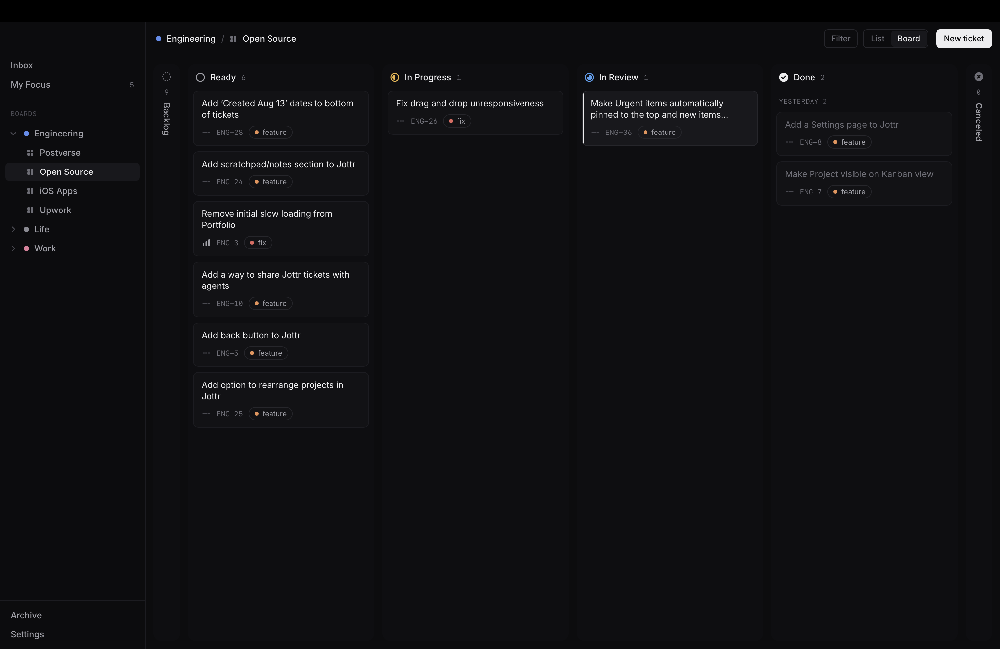

# Jottr

A lightweight, fast Kanban app for macOS. Single-user and fully local: no account, no server, no network.



## Develop

```sh
npm install
npm run tauri dev     # run the app with live reload
npm run tauri build   # build Jottr.app and a .dmg
```

Requires Xcode Command Line Tools, Node.js and Rust (`rustup`).
